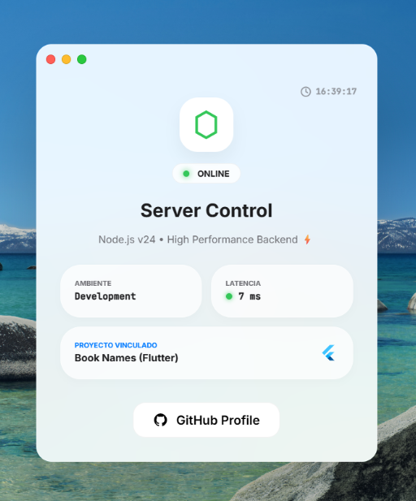

<p align="center">
  
</p>

<h1 align="center">🚀 Book Names Server & macOS Web Dashboard</h1>

<p align="center">
  <strong>Un panel de control web premium inspirado en macOS y servido mediante Node.js para el ecosistema Book Names.</strong>
</p>

<p align="center">
  
  
  
  
  
  
</p>

---

## ✨ Vista Previa del Panel
<p align="center">
  
</p>

## 📖 Sobre el Proyecto
Más que un simple servidor estático, este proyecto es una demostración de **ingeniería frontend pura y diseño web estético**. Su principal atractivo es un panel de control accesible vía navegador que simula de manera asombrosa el entorno de un sistema operativo de escritorio (macOS), operando sin depender de frameworks pesados de JavaScript como React o Angular.

La interfaz web, co-diseñada junto a la **Inteligencia Artificial de Gemini**, rompe con la monotonía de los típicos paneles de administración backend. Ofrece una experiencia inmersiva con ventanas flotantes, un dock interactivo y componentes visuales cristalinos (Glassmorphism), todo alojado y servido por un backend ligero y eficiente construido en Express.

---

## 🛠️ Stack Tecnológico de Élite

| Capa | Tecnologías | Propósito |
| :--- | :--- | :--- |
| **Backend** | `Node.js` + `Express` | Servidor estático optimizado, enrutamiento rápido y arquitectura base. |
| **Frontend** | `HTML5` + `CSS3` + `JavaScript` | Construcción de una interfaz tipo SO 100% "Vanilla", garantizando rendimiento brutal. |
| **Diseño UI/UX** | `Gemini AI` | Asistencia en la conceptualización de micro-interacciones, efectos visuales y estructura del panel. |
| **Configuración** | `dotenv` | Gestión segura de variables de entorno y configuración de puertos del servidor. |

---

## ⚡ Características Asombrosas

- 🪐 **Diseño Inmersivo (Glassmorphism)**: Paneles traslúcidos con desenfoque de fondo y sombras suaves que mimetizan la experiencia nativa de Apple.
- 🪟 **Sistema de Ventanas Múltiples**: Gestión avanzada del DOM para interactuar con "aplicaciones" internas como Finder, Safari y Ajustes simultáneamente sin recargar la página.
- 🍎 **Dock Animado e Interactivo**: Barra de aplicaciones inferior con un efecto de aumento (magnify) fluido al estilo macOS.
- 🔗 **Integración con Ecosistema**: Enlaces integrados y "Safari" configurado para visualizar directamente el repositorio asociado (Book Names).
- 💾 **Persistencia de Estado**: El sistema recuerda tus configuraciones (como el entorno seleccionado) utilizando `localStorage`.

---

## 🔧 Instalación Relámpago

Despliega este entorno en tu máquina local en menos de 2 minutos:

```bash
# 1. Clonar el repositorio
git clone https://github.com/Fabian-Lugo/book-names-server.git

# 2. Entrar a la carpeta
cd book-names-server

# 3. Instalar las dependencias del servidor
npm install

# 4. Iniciar en Modo Desarrollo (Hot Reload)
npm run start:dev
```

---

## 🎓 Contexto Académico & Desarrollo
Este proyecto consolida los conocimientos adquiridos a través de formación profesional y cursos avanzados en **Udemy**. Demuestra que dominando las bases de la web (DOM manual, Vanilla JS y CSS moderno) junto a **Node.js**, es posible crear interfaces ricas, altamente interactivas y visualmente deslumbrantes que superan las expectativas de un "simple dashboard".

---

<p align="center">
  
  
</p>

<p align="center">
  <a href="https://github.com/Fabian-Lugo">
    
  </a>
</p>
